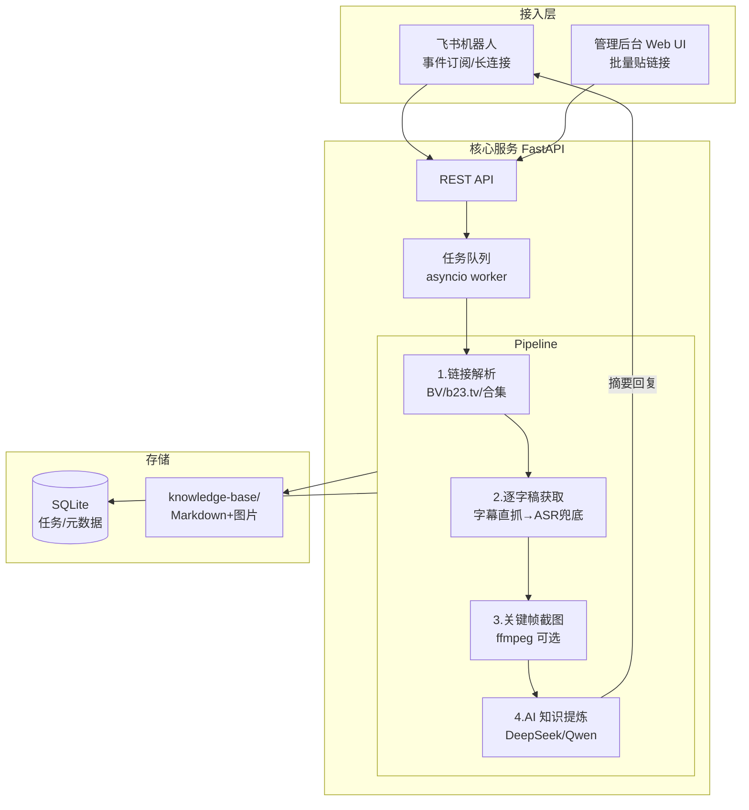

# 02 · 架构设计：B 站视频 → 逐字稿 → 专有开发知识库

> 前置阅读：[01-开源方案调研](01-开源方案调研.md)。
> 已确认决策：字幕优先 + whisper 兜底 · DeepSeek/Qwen 做知识提炼 · 飞书自建机器人应用接入。
>
> ⚠️ **2026-07-08 产品方案修订**：经 brainstorming 对齐，知识产出形态由"知识卡片"升级为
> **AI 可加载的 Agent Skills（含草稿区 + 人工审核门禁）**，图文稿后置。
> §3.4 知识提炼与里程碑排期以
> [superpowers/specs/2026-07-08-knowledge-skills-design.md](superpowers/specs/2026-07-08-knowledge-skills-design.md)
> 为准。

## 1. 总体架构



一套核心服务，两个入口共用同一条 pipeline；所有产物落到文件系统知识库（Markdown + 图片），
元数据进 SQLite。**单机部署即可跑**，无外部基础设施依赖（Redis/MQ 均不需要）。

## 2. 技术栈

| 层 | 选型 | 理由 |
| --- | --- | --- |
| 后端框架 | Python 3.11 + FastAPI | 与 BiliNote 同栈，方便借鉴；异步友好 |
| 任务队列 | asyncio + SQLite 任务表（内置 worker） | 单机批量足够；避免引入 Redis/Celery。任务表即队列，重启可恢复 |
| B 站接口 | bilibili-api-python + httpx | 字幕/视频信息直抓 |
| 音频下载 | BBDown（首选）/ yt-dlp（备选，配置切换） | 仅下载音频流省带宽 |
| ASR 兜底 | faster-whisper（small/medium, int8）；引擎接口可插拔，预留 FunASR | 免费本地，CPU 可跑 |
| 截图 | ffmpeg | 按时间戳抽帧 |
| LLM | DeepSeek（`deepseek-chat`）/ Qwen，走 **OpenAI 兼容接口**（base_url 可配） | 已确认决策；两家接口形态一致，一套代码通吃 |
| 飞书 | 飞书开放平台自建应用 + `lark-oapi` SDK，**长连接模式**接收事件 | 长连接无需公网回调地址，内网服务器也能跑 |
| 管理后台前端 | 第一期用 FastAPI + Jinja2 服务端渲染（够用）；后续需要再上 React | 降低首期复杂度 |
| 存储 | SQLite + 文件系统 | 单机零运维 |

## 3. 核心模块设计

### 3.1 链接解析器（`resolver`）

输入任意形态的 B 站链接，输出标准化视频清单：

- 支持：`https://www.bilibili.com/video/BV...`、`b23.tv` 短链（跟随重定向）、
  带 `?p=n` 的分 P、**合集/收藏夹链接（展开为多条视频 → 天然支持批量）**、纯 BV 号
- 输出：`[{bvid, cid, part_no, title, duration, up_name, cover_url}]`

### 3.2 逐字稿获取（`transcriber`）—— 字幕优先 + ASR 兜底

```
输入 (bvid, cid)
  ├─ ① 抓字幕列表 GET /x/player/wbi/v2 （带 SESSDATA Cookie）
  │     ├─ 有人工 CC 字幕 → 用之（质量最高）
  │     ├─ 只有 ai-zh AI 字幕 → 用之（质量可接受，标记来源）
  │     └─ 无字幕 / 接口失败 →
  ├─ ② ASR 兜底：BBDown 仅下载音频 → faster-whisper 转写
  └─ 输出统一格式 Transcript：
        {source: "cc"|"ai-subtitle"|"whisper", segments: [{start, end, text}]}
```

要点：

- 三种来源输出**统一的 segment 结构**（带时间戳），下游截图和提炼不感知来源；
- 字幕接口调用间隔 ≥3s + 随机抖动，失败自动降级到 ASR，不阻塞任务；
- ASR 引擎做成接口（`transcribe(audio_path) -> segments`），faster-whisper 为默认实现，
  预留 FunASR 实现（中文课程若识别不佳时切换）；
- 逐字稿两种产物：`transcript.md`（可读逐字稿，按段落合并、带时间戳锚点）
  和 `transcript.json`（原始 segments，供程序消费）。

### 3.3 截图服务（`snapshotter`，可选步骤）

- 仅当任务开启"图文稿"时执行（需额外下载视频流）；
- 抽帧策略：按逐字稿段落切分点抽帧（每 N 分钟至少 1 张，可配），
  ffmpeg `-ss` 精确定位；
- 产物：`images/{seq}_{timestamp}.jpg` + 在 `article.md` 图文稿中按时间轴内联引用。

### 3.4 AI 知识提炼（`distiller`）—— 两段式

**第一段：清洗**。逐字稿口语转书面语：去语气词、修正 ASR 错别字、按主题分节，
输出 `cleaned.md`。长视频按 token 上限分块处理再拼接。

**第二段：提炼知识卡片**。结合"项目上下文描述"（配置文件里维护一段我们项目的技术栈、
业务域、当前痛点的说明，作为 system prompt 的一部分），从清洗稿中提取：

```yaml
# knowledge-base/cards/{card_id}.md 的 frontmatter
title: 知识点标题
source_video: BV1xxx（时间戳锚点）
category: 工程实践 | 架构模式 | 工具链 | 流程方法 | 避坑
relevance: 与我们项目的关联点（LLM 判断 + 说明为什么对我们有用）
actionable: 可直接落地的动作建议（如无则标记"仅供参考"）
confidence: high | medium | low
---
正文：知识点详述 + 原文引用（带时间戳）
```

- LLM 调用统一走 OpenAI 兼容客户端，`LLM_BASE_URL`/`LLM_MODEL`/`LLM_API_KEY` 三个配置切换
  DeepSeek（`https://api.deepseek.com`）或 Qwen（DashScope 兼容端点）；
- 每张卡片保留到源视频时间戳的溯源链接，方便回看原片验证；
- 卡片是**追加式**沉淀：跨视频的知识库由目录结构 + 索引文件（`INDEX.md`，按 category 归组，
  提炼时自动更新）组织，后续可再演进为向量检索。

### 3.5 飞书机器人（`feishu_bot`）

- 飞书开放平台**自建应用**，机器人能力 + `im.message.receive_v1` 事件订阅，
  使用 `lark-oapi` SDK 的**长连接（WebSocket）模式**——无需公网回调 URL，内网可跑；
- 交互流程：
  1. 用户私聊或群 @机器人 发含 B 站链接的消息；
  2. 机器人立即回复"已受理，任务 #id"（解析出多视频时列出清单）；
  3. pipeline 完成后回复卡片消息：视频标题、来源（CC/AI 字幕/whisper）、
     摘要、知识卡片数、服务器落盘路径；逐字稿全文过长不刷屏，指向知识库路径/后台链接；
- "保存到本地" = 保存到**部署服务器的 `knowledge-base/` 目录**（与管理后台共用同一知识库）。

### 3.6 管理后台（`admin`）

第一期页面（服务端渲染，简单够用）：

- **任务提交页**：文本框粘贴链接（每行一条，支持合集链接），勾选"生成图文稿/知识提炼"；
- **任务列表页**：状态（排队/下载/转写/提炼/完成/失败）、来源（飞书/后台）、进度、重试按钮；
- **成果详情页**：逐字稿预览、图文稿（图片+文字）预览、知识卡片列表、一键复制 Markdown；
- **知识库浏览页**：按 category 浏览全部知识卡片。

## 4. 数据模型（SQLite）

```
tasks         (id, url, bvid, cid, title, source[feishu|admin], options_json,
               status[pending|downloading|transcribing|snapshotting|distilling|done|failed],
               error, created_at, updated_at, feishu_chat_id)
transcripts   (id, task_id, source[cc|ai-subtitle|whisper], json_path, md_path, duration_sec)
articles      (id, task_id, md_path, image_count)          -- 图文稿
cards         (id, task_id, title, category, relevance, confidence, md_path, created_at)
```

## 5. 知识库目录结构（文件即产品）

```
knowledge-base/
├── INDEX.md                          # 自动维护的总索引（按 category）
├── videos/
│   └── BV1xxx-视频标题/
│       ├── meta.json                 # 视频元数据
│       ├── transcript.json           # 原始 segments
│       ├── transcript.md             # 可读逐字稿
│       ├── cleaned.md                # AI 清洗稿
│       ├── article.md                # 图文稿（引用 images/）
│       └── images/
└── cards/
    └── {category}/{card_id}-标题.md  # 知识卡片
```

纯 Markdown + 图片落盘的好处：可直接 git 管理、可被任何编辑器/wiki 消费、
后续也能整体喂给 AI 编程助手作为项目上下文。

## 6. API 设计（核心服务）

```
POST /api/tasks              # 提交任务 {urls: [...], options: {article, distill}}
GET  /api/tasks?status=&page=
GET  /api/tasks/{id}         # 含产物路径
POST /api/tasks/{id}/retry
GET  /api/cards?category=
GET  /api/kb/index           # 知识库索引
```

飞书事件不走这些 API，由 `feishu_bot` 进程内直接调 service 层（同一进程部署）。

## 7. 配置项（.env）

```
BILI_SESSDATA=          # B 站普通账号 Cookie，抓 AI 字幕必需
FEISHU_APP_ID=          # 飞书自建应用
FEISHU_APP_SECRET=
LLM_BASE_URL=https://api.deepseek.com   # 或 Qwen DashScope 兼容端点
LLM_API_KEY=
LLM_MODEL=deepseek-chat
WHISPER_MODEL=small     # small/medium/large-v3
DOWNLOADER=bbdown       # bbdown | yt-dlp
KB_ROOT=./knowledge-base
PROJECT_CONTEXT_FILE=./project-context.md   # 知识提炼用的项目背景描述
```

## 8. 部署

- 单机 Docker Compose：一个服务容器（FastAPI + worker + 飞书长连接同进程）+ 挂载
  `knowledge-base/` 和 SQLite 卷；镜像内置 ffmpeg、BBDown、faster-whisper 模型缓存；
- 资源预估：CPU 4 核 / 内存 8G 可跑 whisper-small；纯字幕直抓路径几乎无资源消耗。

## 9. 关键风险与对策

| 风险 | 对策 |
| --- | --- |
| B 站逆向接口变更/风控（字幕接口需登录，高频会失效） | 请求限频 ≥3s+抖动；接口失败自动降级 ASR；SESSDATA 可热更换 |
| ASR 中文识别质量不足 | 引擎可插拔，备选 FunASR Paraformer；卡片标 confidence 提示人工复核 |
| 长视频 LLM 上下文超限 | 清洗阶段分块 map-reduce；提炼阶段基于清洗稿（已大幅缩短） |
| 版权合规 | 知识库仅内部使用；产物保留来源链接；不做对外分发功能 |
| 飞书消息并发/重复投递 | 事件去重（event_id）；任务表幂等（同 bvid+options 短期去重） |
